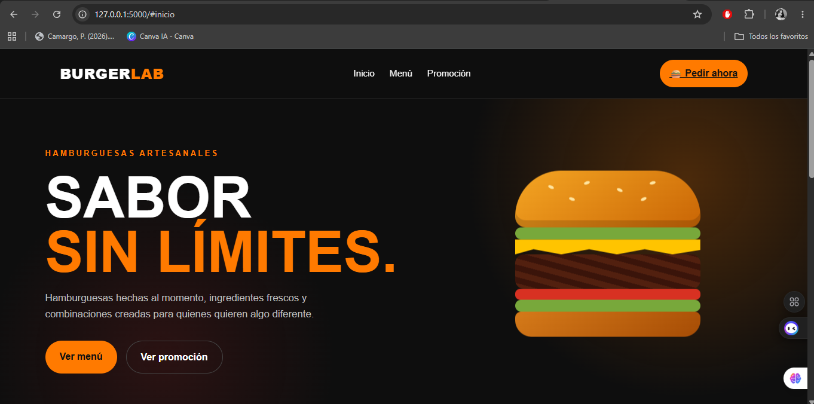
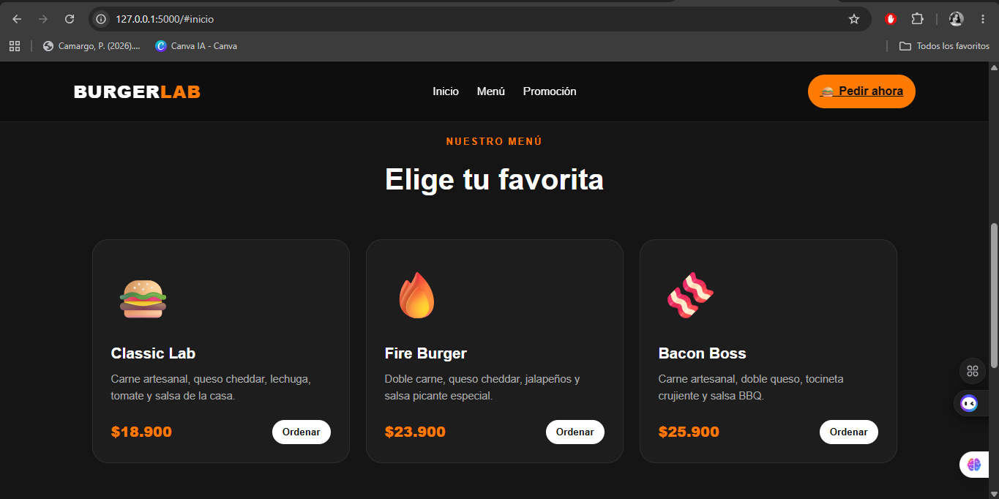
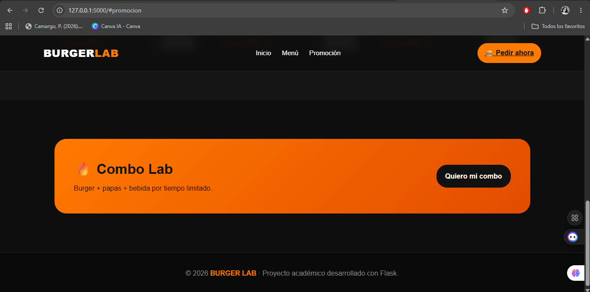

# Taller Nuevas Tecnologías

## Descripción

Repositorio académico correspondiente al taller de **Nuevas Tecnologías**.

El proyecto reúne:

- Una aplicación **To-Do List** desarrollada en Python.
- Una aplicación web desarrollada con **Flask**.
- Una interfaz temática de hamburguesería llamada **BURGER LAB**, desarrollada con HTML y CSS.

## Tecnologías utilizadas

- Python
- Flask
- HTML5
- CSS3
- Git
- GitHub

## Estructura del proyecto

```text
tallerNuevasTecnologias/
├── app.py
├── to-do.py
├── requirements.txt
├── README.md
├── .gitignore
├── templates/
│   └── index.html
└── evidencia/
    ├── inicio.png
    ├── menu.png
    └── promocion.png
```

## Configuración y ejecución

### 1. Crear la carpeta del proyecto

```bash
mkdir tallerNuevasTecnologias
cd tallerNuevasTecnologias
```

### 2. Abrir el proyecto con Visual Studio Code

```bash
code .
```

### 3. Crear el entorno virtual

```bash
python -m venv venv
```

### 4. Activar el entorno virtual

En Windows PowerShell:

```powershell
venv\Scripts\activate
```

Si PowerShell bloquea los scripts, usar:

```powershell
Set-ExecutionPolicy -Scope Process -ExecutionPolicy Bypass
venv\Scripts\activate
```

Cuando se active correctamente aparecerá `(venv)` al inicio de la terminal.

### 5. Instalar las librerías

```bash
pip install -r requirements.txt
```

Para comprobar las librerías instaladas:

```bash
pip list
```

## Aplicación To-Do List

La aplicación To-Do List se ejecuta con:

```bash
python to-do.py
```

## Aplicación Flask

La aplicación web Flask se ejecuta con:

```bash
python app.py
```

Después de iniciar Flask, abrir en el navegador:

```text
http://127.0.0.1:5000
```

La interfaz desarrollada corresponde a **BURGER LAB**, una propuesta de hamburguesería con navegación, sección principal, menú y promoción.

## Evidencia de ejecución

### Página principal



### Menú



### Promoción



## Comandos Git vistos en clase

### Inicializar un repositorio local

```bash
git init
```

### Revisar el estado del repositorio

```bash
git status
```

### Agregar cambios

```bash
git add .
```

También es posible agregar un archivo específico:

```bash
git add nombre_archivo
```

### Crear un commit

```bash
git commit -m "mensaje"
```

Ejemplo utilizado en el proyecto:

```bash
git commit -m "Se cambio el archivo html, por una pagina web de comida rapida"
```

### Crear y enlazar el repositorio remoto

Después de crear el repositorio público en GitHub:

```bash
git remote add origin https://github.com/Johami/tallerNuevasTecnologias.git
git branch -M main
```

### Publicar el repositorio en GitHub

```bash
git push -u origin main
```

Para publicar nuevos cambios posteriormente:

```bash
git add .
git commit -m "mensaje"
git push
```

## Repositorio en GitHub

[https://github.com/Johami/tallerNuevasTecnologias](https://github.com/Johami/tallerNuevasTecnologias)

## Autor

Proyecto académico desarrollado para la asignatura de **Nuevas Tecnologías**.
